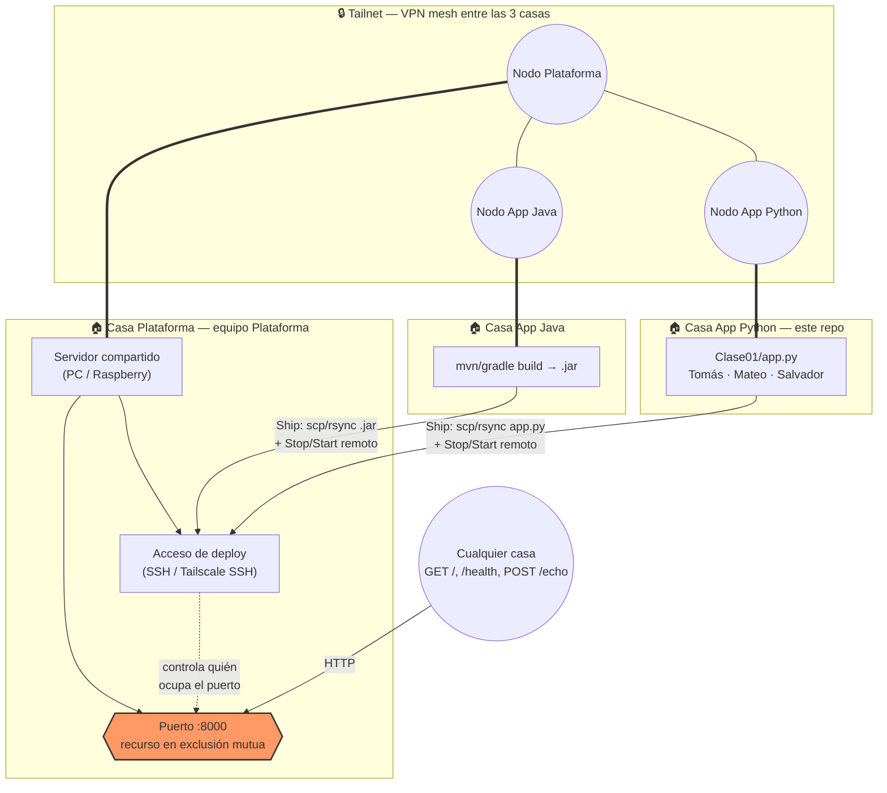
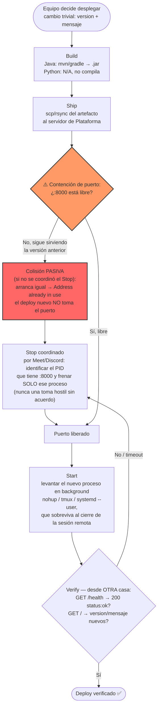

# Sistemas Distribuidos y Programación Paralela (SDyPP) - Mini-Nube

Servidor HTTP liviano desarrollado en Python para la simulación de despliegues manuales, traspaso de mando y gestión de concurrencia sobre un puerto TCP compartido.

---

## 👥 Integrantes del Equipo
* **Tomás Resnik** — Legajo 190168
* **Mateo Nomico** — Legajo 168102
* **Salvador Baez** — Legajo 195157

---

## 🚀 Endpoints de la Aplicación

| Método | Ruta | Descripción |
| :--- | :--- | :--- |
| `GET` | `/` | Retorna metadatos de la app (nombre, equipo, versión, timestamp de arranque y host). |
| `GET` | `/health` | Chequeo de salud del servicio (retorna `{"status": "ok"}`). |
| `POST` | `/echo` | Recibe JSON `{"ping": "mensaje"}` y responde `{"pong": "mensaje"}`. |
| `GET` | `/slow` | Endpoint simulador de peticiones en vuelo (sleep de 4s) para probar **Graceful Shutdown**. |

---

## 🏗️ Diagrama de Arquitectura

Tres casas, ninguna en la misma red, coordinadas por Meet/Discord. El equipo **Plataforma** monta
el servidor compartido y reparte el acceso; **App Java** y **App Python** compiten por el mismo
puerto de producción, que es el recurso compartido en exclusión mutua. La conectividad entre casas
se resuelve con una **tailnet (Tailscale)**, para no exponer el puerto ni el acceso de deploy
directamente a internet.



**Qué expone cada nodo:**
- **Plataforma**: el puerto de producción (HTTP, hoy solo lo tiene una app a la vez) + el acceso
  de deploy (canal para que los otros dos equipos suban su artefacto y controlen el proceso).
- **App Java / App Python**: nada hacia afuera directamente — despliegan *sobre* el nodo de
  Plataforma, no exponen servidor propio.
- **Recurso compartido y disputado**: el puerto `:8000` del servidor de Plataforma. Solo un
  proceso lo escucha a la vez; desplegar es un traspaso (parar al que está, recién ahí escuchar).

---

## 🔄 Diagrama de Flujo del Pipeline (Build → Ship → Stop → Start → Verify)



En la demo del martes se provoca la **colisión pasiva a propósito** (dos equipos intentan
desplegar a la vez sin coordinar el Stop), se la reconoce por el error `Address already in use`,
y recién después se muestra el traspaso ordenado (Stop coordinado → Start → Verify).

---

## 🌟 Aportes Propios Justificados

---

### Aporte 1: Graceful Shutdown & Drenado de Conexiones

#### ¿En qué consiste?
Implementación de un manejador de señales a nivel del Sistema Operativo (`signal.SIGTERM` y `signal.SIGINT`) en el servidor `ThreadingHTTPServer`. 

Cuando el proceso recibe una señal de detención (`kill <PID>` o `Ctrl+C`):
1. **Deja de aceptar nuevas conexiones** cerrando el listener del socket TCP de inmediato (liberando el puerto para el siguiente despliegue).
2. **Drena las conexiones activas**: Espera a que las peticiones HTTP que ya se encontraban en curso (en ejecución en sus respectivas hebras) terminen de procesarse y responder al cliente.
3. **Apaga el proceso de forma limpia** sin dejar sockets colgados en estado `TIME_WAIT`.

---

#### ¿Cómo probarlo?

1. **Iniciar el servidor en una terminal**:
   ```bash
   python3 Clase01/app.py 8000
   ```
   *Anotar el PID que imprime en pantalla (ejemplo: PID 13058).*

2. **Lanzar una petición en vuelo (lenta) desde otra terminal**:
   ```bash
   curl -i http://<IP_ADDRESS>:8000/slow
   ```
   *(Esta petición tarda 4 segundos en responder).*

3. **Inmediatamente (dentro de los 4 segundos), enviar la señal `SIGTERM` desde una tercera terminal**:
   ```bash
   # Reemplazar <PID> por el PID real de tu servidor
   kill -15 <PID>
   ```

4. **Resultado Observado**:
   * **En la terminal del `curl`**: La petición **NO se corta**. Espera sus 4 segundos y recibe un `200 OK` completo con el JSON de respuesta.
   * **En la terminal del servidor**: Se observa el log:
     ```text
     [ Graceful Shutdown ] Recibida señal SIGTERM (señal 15). Drenando conexiones y apagando servidor de forma limpia...
     [/slow] Petición lenta finalizada.
     [ Graceful Shutdown ] Puerto TCP liberado y servidor detenido exitosamente.
     ```
   * El puerto 8000 queda inmediatamente disponible para que otro integrante pueda levantar su app sin sufrir la colisión pasiva (`Address already in use`).

---

### Aporte 2: Hash de Integridad del Código en Tiempo de Ejecución (SHA-256)

#### ¿En qué consiste?
Al arrancar, la aplicación lee su propio archivo fuente (`app.py`), calcula su checksum criptográfico SHA-256 utilizando la librería estándar (`hashlib`) y lo expone en el campo `"checksum"` de las respuestas `GET /` y `GET /health`.

---

#### ¿Cómo probarlo?

1. **Consultar el hash remoto desplegado**:
   ```bash
   curl -s http://<IP_ADDRESS>:8000/health
   ```
   *Respuesta recibida:*
   ```json
   {
     "status": "ok",
     "app": "python",
     "version": 1,
     "checksum": "a3f8b1c4e5..."
   }
   ```

2. **Verificar localmente con sha256sum**:
   ```bash
   sha256sum Clase01/app.py
   ```
   Comprobar que el hash obtenido localmente coincide exactamente con el valor devuelto por el servidor remoto, confirmando la integridad.

---

### Aporte 3: Rate Limiting en Memoria (Protección contra Sobrecarga)

#### ¿En qué consiste?
Implementación de un limitador de tasa mediante el algoritmo de ventana deslizante en memoria (`Sliding Window`). Cada cliente (IP) puede realizar un máximo de 5 peticiones cada 10 segundos. Al superar este límite, el servidor bloquea temporalmente al cliente respondiendo con código HTTP `429 Too Many Requests`.

---

#### ¿Cómo probarlo?

1. **Enviar ráfaga de peticiones continuas**:
   ```bash
   for i in {1..6}; do curl -s -i http://<IP_ADDRESS>:8000/health | head -n 1; done
   ```

2. **Resultado Observado**:
   * Peticiones 1 a 5: `HTTP/1.0 200 OK`
   * Petición 6: `HTTP/1.0 429 Too Many Requests` con el JSON de error:
     ```json
     {
       "error": "Demasiadas peticiones (429 Too Many Requests)",
       "mensaje": "Se superó el límite de 5 peticiones cada 10 segundos.",
       "ip": "<IP_ADDRESS>"
     }
     ```