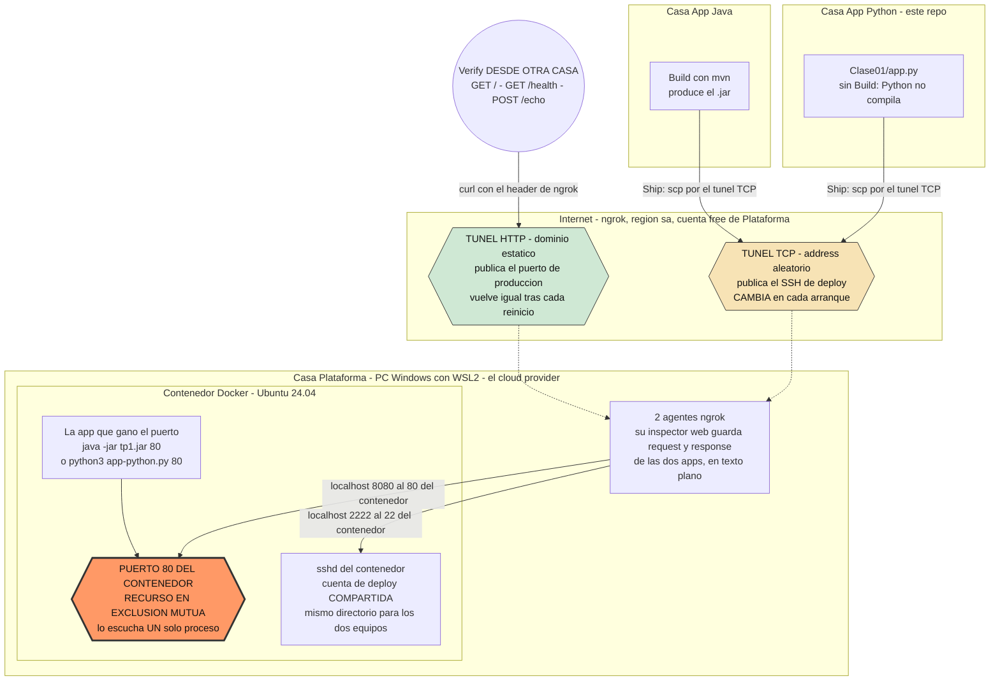
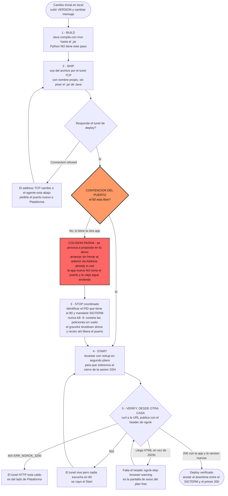

# Sistemas Distribuidos y Programación Paralela (SDyPP) - Mini-Nube

Servidor HTTP liviano desarrollado en Python para la simulación de despliegues manuales, traspaso de mando y gestión de concurrencia sobre un puerto TCP compartido.

---

## 👥 Integrantes del Equipo
* **Tomás Resnik** — Legajo 190168
* **Mateo Nomico** — Legajo 168102
* **Salvador Baez** — Legajo 195157

---

## Comandos 

* python3 -m venv .venv
* source .venv/bin/activate (Segun el sistema operativo usar el comando correspondiente)
* pip install -r requirements.txt
* python3 app.py 8081

## 🚀 Endpoints de la Aplicación

| Método | Ruta | Descripción |
| :--- | :--- | :--- |
| `GET` | `/` | Retorna metadatos de la app (nombre, equipo, versión, timestamp de arranque y host). |
| `GET` | `/health` | Chequeo de salud del servicio (retorna `{"status": "ok"}`). |
| `POST` | `/echo` | Recibe JSON `{"ping": "mensaje"}` y responde `{"pong": "mensaje"}`. |
| `GET` | `/slow` | Endpoint simulador de peticiones en vuelo (sleep de 4s) para probar **Graceful Shutdown**. |

---

## 🏗️ Diagrama de Arquitectura

Tres casas, ninguna en la misma red, coordinadas por Meet/Discord. El equipo **Plataforma** monta
el servidor y reparte el acceso; **App Java** y **App Python** compiten por el mismo puerto de
producción, que es el recurso compartido en exclusión mutua.

El servidor no es una máquina expuesta a internet: es un **contenedor Docker con Ubuntu 24.04
dentro de WSL2**, en una PC hogareña detrás de NAT. Plataforma la hace alcanzable con **dos
túneles de ngrok** — uno publica el HTTP de producción, el otro publica el SSH de deploy.



**Qué expone cada nodo:**

- **Plataforma** expone dos cosas y ninguna es la máquina en sí: el **HTTP de producción** por el
  túnel de dominio estático, y el **acceso de deploy** (SSH) por el túnel TCP. Son los árbitros del
  recurso: si apagan un agente, el equipo que dependía de ese túnel queda afuera.
- **App Java / App Python** no exponen nada hacia afuera. Despliegan *sobre* el nodo de Plataforma,
  no corren servidor propio.
- **Recurso compartido y disputado**: el puerto `80` del contenedor (publicado como el `8080` del host). Un puerto TCP lo escucha un
  solo proceso a la vez, así que desplegar no es "instalar al lado": es un **traspaso**.

**Asimetría entre los dos túneles.** El de producción usa un dominio estático y sobrevive a los
reinicios; el de SSH recibe un address aleatorio y **cambia cada vez que Plataforma lo levanta**.
En la práctica eso significa que el canal de deploy se rompe solo y hay que pedir el puerto nuevo,
mientras que la URL que ve el mundo se mantiene.

**Lo que el diagrama deja ver sobre seguridad.** Todo el tráfico de las dos apps pasa por los
agentes de ngrok de Plataforma, cuyo inspector guarda request y response completos en texto plano.
Y el acceso de deploy es una **cuenta de sistema compartida**: no hay forma de distinguir quién
frenó qué proceso.

---

## 🔄 Diagrama de Flujo del Pipeline (Build → Ship → Stop → Start → Verify)



Los comandos exactos de cada paso:

> **Datos de acceso.** El host y el puerto del túnel de deploy, el usuario y su contraseña **no se
> versionan**: los publica el equipo Plataforma por Discord y cambian cada vez que reinician el
> agente de ngrok. Los `<PLACEHOLDER>` de abajo se reemplazan al momento de desplegar.


```bash
# 2 · Ship
scp -P <PUERTO_NGROK> Clase01/app.py <USUARIO>@<HOST_TCP_NGROK>:/home/<USUARIO>/app-python.py

# 3 · Stop  (dentro del servidor)
ssh -p <PUERTO_NGROK> <USUARIO>@<HOST_TCP_NGROK>
ps aux | grep -E 'java|python3'
kill <PID>

# 4 · Start
nohup python3 ~/app-python.py 80 > ~/python.log 2>&1 &

# 5 · Verify  (desde otra casa)
curl -s -H "ngrok-skip-browser-warning: 1" https://<DOMINIO>.ngrok-free.dev/
curl -s -H "ngrok-skip-browser-warning: 1" https://<DOMINIO>.ngrok-free.dev/health
```

En la demo se provoca la **colisión pasiva a propósito** (arrancar sin coordinar el Stop), se la
reconoce por el `Address already in use`, y se muestra que la app anterior siguió sirviendo sin
enterarse. Recién después va el traspaso ordenado: Stop → Start → Verify.

---

## 🌟 Aportes Propios Justificados

---

### Aporte 1: Graceful Shutdown & Drenado de Conexiones

#### ¿En qué consiste?
Implementación de un manejador de señales a nivel del Sistema Operativo (`signal.SIGTERM` y `signal.SIGINT`) en el servidor `ThreadingHTTPServer`. 

Cuando el proceso recibe una señal de detención (`kill <PID>` o `Ctrl+C`):
1. **Deja de aceptar nuevas conexiones** cerrando el listener del socket TCP de inmediato (liberando el puerto para el siguiente despliegue).
2. **Drena las conexiones activas**: Espera a que las peticiones HTTP que ya se encontraban en curso (en ejecución en sus respectivas hebras) terminen de procesarse y responder al cliente.
3. **Apaga el proceso de forma limpia**. Quedan sockets en `TIME_WAIT` — es inevitable en TCP —
   pero el servidor activa `SO_REUSEADDR`, así que el siguiente deploy toma el 8080 igual,
   sin esperar el minuto de espera del kernel.

---

#### ¿Cómo probarlo?

1. **Iniciar el servidor en una terminal**:
   ```bash
   python3 Clase01/app.py 8080
   ```
   *Anotar el PID que imprime en pantalla (ejemplo: PID 13058).*

2. **Lanzar una petición en vuelo (lenta) desde otra terminal**:
   ```bash
   curl -i http://<IP_ADDRESS>:8080/slow
   ```
   *(Esta petición tarda 4 segundos en responder).*

3. **Inmediatamente (dentro de los 4 segundos), enviar la señal `SIGTERM` desde una tercera terminal**:
   ```bash
   # Reemplazar <PID> por el PID real de tu servidor
   kill -15 <PID>
   ```

4. **Resultado Observado**:
   * **En la terminal del `curl`**: La petición **NO se corta**. Espera sus 4 segundos y recibe un `200 OK` completo con el JSON de respuesta.
   * **En la terminal del servidor**: Se observa el log:
     ```text
     [ Graceful Shutdown ] Recibida señal SIGTERM (señal 15). Drenando conexiones y apagando servidor de forma limpia...
     [/slow] Petición lenta finalizada.
     [ Graceful Shutdown ] Puerto TCP liberado y servidor detenido exitosamente.
     ```
   * El puerto 8080 queda inmediatamente disponible para que otro integrante pueda levantar su app sin sufrir la colisión pasiva (`Address already in use`).

---

### Aporte 2: Hash de Integridad del Código en Tiempo de Ejecución (SHA-256)

#### ¿En qué consiste?
Al arrancar, la aplicación lee su propio archivo fuente (`app.py`), calcula su checksum criptográfico SHA-256 utilizando la librería estándar (`hashlib`) y lo expone en el campo `"checksum"` de las respuestas `GET /` y `GET /health`.

---

#### ¿Cómo probarlo?

1. **Consultar el hash remoto desplegado**:
   ```bash
   curl -s http://<IP_ADDRESS>:8080/health
   ```
   *Respuesta recibida:*
   ```json
   {
     "status": "ok",
     "app": "python",
     "version": 1,
     "checksum": "a3f8b1c4e5..."
   }
   ```

2. **Verificar localmente con sha256sum**:
   ```bash
   sha256sum Clase01/app.py
   ```
   Comprobar que el hash obtenido localmente coincide exactamente con el valor devuelto por el servidor remoto, confirmando la integridad.

---

### Aporte 3: Rate Limiting en Memoria (Protección contra Sobrecarga)

#### ¿En qué consiste?
Implementación de un limitador de tasa mediante el algoritmo de ventana deslizante en memoria (`Sliding Window`). Cada cliente (IP) puede realizar un máximo de 5 peticiones cada 10 segundos. Al superar este límite, el servidor bloquea temporalmente al cliente respondiendo con código HTTP `429 Too Many Requests`.

---

#### ¿Cómo probarlo?

1. **Enviar ráfaga de peticiones continuas**:
   ```bash
   for i in {1..6}; do curl -s -i http://<IP_ADDRESS>:8080/health | head -n 1; done
   ```

2. **Resultado Observado**:
   * Peticiones 1 a 5: `HTTP/1.0 200 OK`
   * Petición 6: `HTTP/1.0 429 Too Many Requests` con el JSON de error:
     ```json
     {
       "error": "Demasiadas peticiones (429 Too Many Requests)",
       "mensaje": "Se superó el límite de 5 peticiones cada 10 segundos.",
       "ip": "<IP_ADDRESS>"
     }
     ```

## Mejoras al Enunciado

Tres huecos de la consigna que encontramos montando esto.

### 1. Pide exclusión mutua, pero no da con qué construirla
**Qué:** exigir una cuenta de sistema por equipo y un archivo de dueño en el servidor (PID, equipo, hora de arranque) que haya que leer antes de frenar nada.
**Por qué:** los tres equipos entramos con el mismo usuario, así que no existe la noción de "dueño" de un proceso: cualquiera puede matar cualquier cosa y nadie puede probar quién fue. La consigna pregunta si se puede lograr que sólo el dueño mate su proceso, pero el armado que habilita lo vuelve imposible.

### 2. El pipeline no tiene salida de emergencia
**Qué:** un sexto paso obligatorio, Rollback, y que el Ship deje los artefactos versionados en vez de sobrescribir.
**Por qué:** la secuencia termina en Verify y no dice qué hacer si Verify falla. Para ese momento el proceso viejo ya está muerto y el artefacto anterior pisado (le pasó a Java, la v2 sobrescribió a la v1), así que producción queda caída sin camino de vuelta.

### 3. Las preguntas de seguridad miran el disco, no el tráfico
**Qué:** que el contrato incluya una ruta que maneje un dato sensible (un token en un header) y que cada equipo explique, salto por salto, quién puede leerlo.
**Por qué:** la consigna pregunta qué le impide a Plataforma leer el código ajeno, pero el agujero más grande es otro: toda la conectividad pasa por el túnel que ellos montan, y su inspector les muestra cada petición y respuesta completas de las dos apps en texto plano.

---

## Preguntas de Análisis Distribuidos

El puerto TCP de producción es el recurso crítico y el único árbitro físico que garantiza la exclusión mutua es el kernel del servidor al procesar la syscall `bind()`, rebotando cualquier intento concurrente con el error `Address already in use`. En la arquitectura de esta tarea la exclusión mutua es de carácter centralizado, ya que no existe un protocolo de consenso distribuido entre las casas de los integrantes y toda la contención se resuelve en el único servidor de Plataforma. La coordinación entre equipos fuera del sistema operativo se sostiene de forma puramente social mediante acuerdos por canal de chat.

Si dos equipos intentan desplegar al mismo tiempo se produce una condición de carrera no determinista dictada por el scheduling del kernel y la latencia de la red. En una colisión pasiva la aplicación que primero logra ejecutar la llamada `bind()` se queda con el puerto, mientras que la segunda falla inmediatamente al recibir el error de dirección en uso y finaliza. En una colisión activa donde se ejecutan comandos de detención sin coordinación previa, los procesos pueden matarse entre sí o corromper los archivos transferidos si comparten la misma ruta de subida.

El pipeline manual carece de atomicidad y transaccionalidad, por lo que una caída de conectividad en pleno despliegue deja al sistema en un estado inconsistente. Si la falla ocurre durante la transferencia del artefacto el archivo queda incompleto en disco pero el servicio anterior continúa respondiendo. Si el corte sucede entre el frenado de la app anterior y la inicialización de la nueva, el puerto queda libre sin ningún proceso escuchando y se genera una denegación de servicio total. Si la conexión cae durante la ejecución y la app no fue desvinculada del pseudo-terminal remoto, la señal enviada por la sesión SSH terminada mata al proceso nuevo.

Los pasos que evidenciaron la necesidad de automatización fueron stop, kill process, y levantar el proceso con controles de exclusión mutua.

---

## Preguntas Picantes

Técnicamente a Mateo y Juan no les impide absolutamente nada leer, modificar o tumbar las aplicaciones ajenas. Al ser los administradores del servidor y del host tienen privilegios de superusuario que les permiten acceder al disco rígido, inspeccionar la memoria RAM de los procesos en ejecución, modificar los archivos subidos vía SSH o matar cualquier proceso con un comando. Tampoco existe cifrado en reposo o aislamiento que proteja el código frente al root del sistema. En un entorno de producción real nadie le confiaría código o datos sensibles a la máquina de un tercero sin garantías de computación confidencial o enclaves seguros; en este escenario la seguridad no se apoya en ningún control técnico sino en la pura confianza social entre compañeros.

Cualquier equipo puede frenar la aplicación del otro simplemente porque todos acceden a través de la misma cuenta de sistema o con permisos suficientes para enviar señales a la tabla de procesos. Para evitar que un usuario apague el servicio ajeno por error o con mala intención se requiere implementar cuentas del sistema operativo independientes para cada equipo. El kernel de Linux prohíbe que un usuario no privilegiado le envíe señales como SIGTERM o SIGKILL a procesos que pertenecen a otro identificador de usuario. De este modo, la única forma de liberar el puerto de manera ordenada sin dar permisos cruzados de detención es mediante un proceso intermediario supervisor o un contrato de orchestración que valide la identidad del solicitante.

Al publicar la computadora hogareña a internet mediante túneles o apertura de puertos, la máquina queda expuesta a escaneos automáticos de vulnerabilidades, ataques de fuerza bruta contra el puerto SSH y posibles ejecuciones remotas de código si las aplicaciones web contienen fallas. El peligro no se limita a esa PC sino que se extiende a toda la red local de la casa, ya que si un atacante logra comprometer el servidor puede realizar movimientos laterales hacia otros dispositivos conectados a la misma red WiFi o LAN. La responsabilidad legal y operativa recae de forma exclusiva sobre el dueño del equipo y titular del contrato de internet, cuya dirección IP pública es la que queda registrada ante cualquier actividad maliciosa originada desde su nodo.

Para realizar el despliegue los equipos ingresan al servidor con acceso a una shell interactiva del sistema operativo. Si las credenciales otorgadas cuentan con permisos amplios o acceso al grupo de sudo o Docker, los integrantes no solo pueden desplegar su aplicación sino también inspeccionar archivos privados en el directorio del sistema, listar variables de entorno globales, consumir recursos de CPU y memoria provocando una denegación de servicio local, o incluso realizar un escape de contenedor hacia la máquina host de Windows. La gestión segura de accesos exigiría aplicar el principio de menor privilegio limitando a los usuarios mediante entornos restringidos y directorios aislados sin visión del resto del sistema.

Cualquier credencial, token o contraseña que utilice la aplicación queda expuesta a la vista de los administradores y de cualquiera con acceso al servidor si se almacena en el código fuente, en archivos de configuración o en variables de entorno. Adicionalmente existe una trampa en el tráfico de red: al utilizar túneles de ngrok administrados por Plataforma, el inspector de tráfico integrado expone en texto plano el contenido de cada petición y respuesta HTTP. Toda clave enviada en los encabezados o en el cuerpo de las peticiones queda registrada y legible en la consola local del inspector para quien monta la infraestructura.